# MCOS
一个**十分简单**的X32操作系统内核。使用C语言和汇编语言编写。实现了OS内核该有的基础功能。

*'M'意为Micro，C意为complete，总的意思为小但是功能较为齐全的OS内核*

# 实现的功能
+ 多进程，多线程，内核级线程（核心级线程）。
+ 区分内核态和用户态
+ 内存模型为平坦模型。
+ 段页式内存管理，每个程序拥有4GB的虚拟内存，内核空间和用户空间隔离。
+ 简单的文件系统，支持文件的增删改查，不支持目录。
+ 几个系统调用 open write read malloc putchar puts gets createThread
+ 加载指定扇区的ELF32文件，手动写入扇区后修改源代码运行。

# 使用方法
## 环境搭建
### windows + Linux任意发行版
需要windows和linux任意发行版。win下安装bochs，至于linux环境可以选择安装虚拟机。如果有Windows10的话推荐使用自带的linux子系统，具体如何开启可以使用搜索引擎搜索到，这里不再叙述。

如果使用win10自带的linux子系统，则可能需要在两个环境之间交换文件，在linux子系统中可以访问windows目录，路径为
```
/mnt
```
目录下会有几个文件夹，对应的时win下的盘符，进入对应文件夹访问即可访问win下对应的文件（修改删除新建查看等）。

### bochs配置

需要用到tools目录下的两个文件“fixvhdwr.exe”和“bochsrc.bxrc”

1. 在win下创建.vhd文件（具体如何做可自行搜索），推荐大小为100MB
2. 安装好bochs后将“bochsrc.bxrc”拷贝到bochs的安装目录
3. 运行bochs目录下的“bochsdbg.exe”，按照如下步骤操作
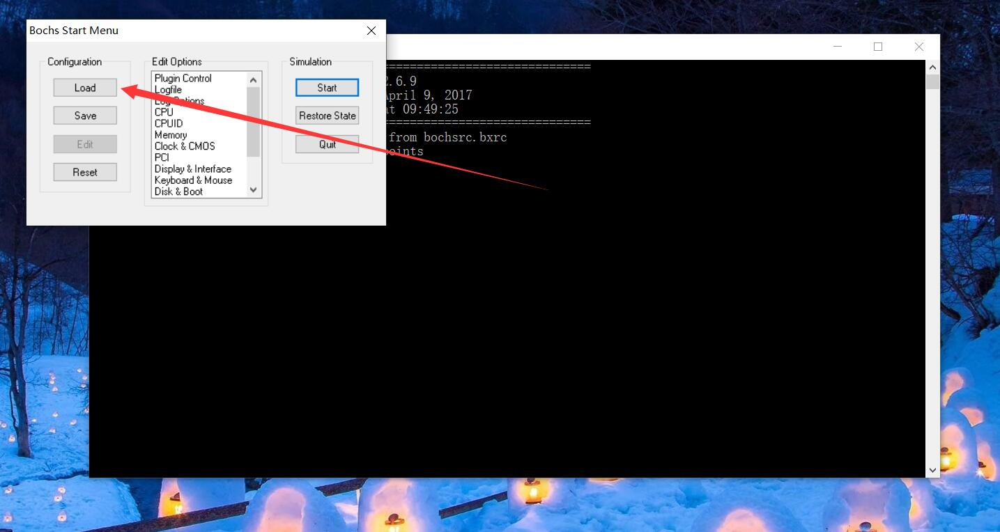
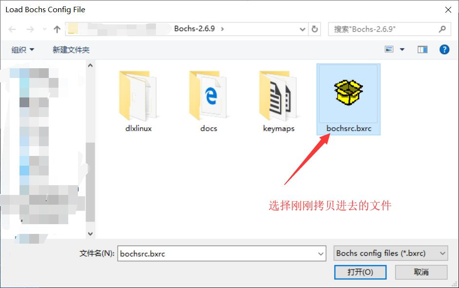
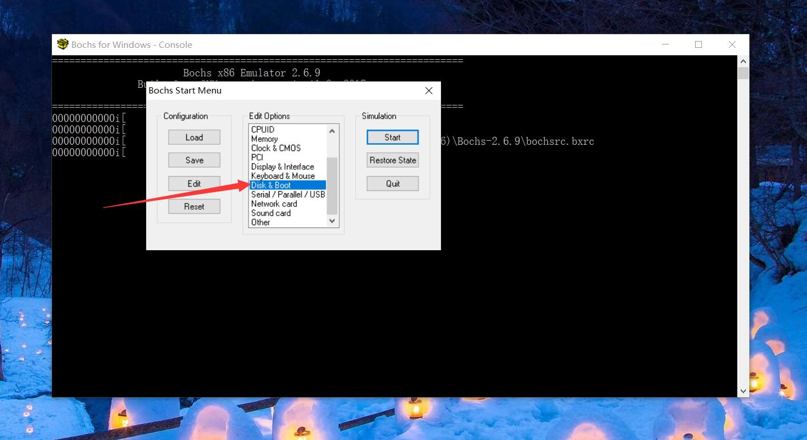
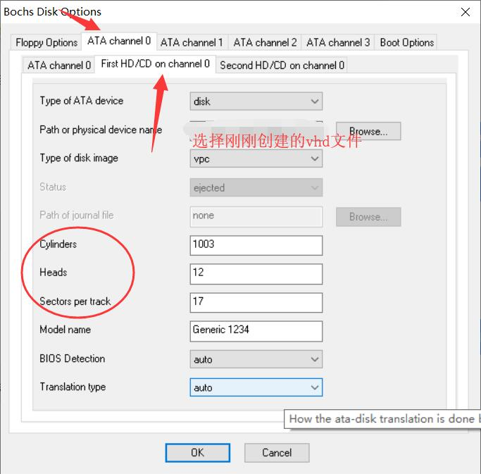

**按照上图的配置，其中红圈内的内容分别是 柱面 磁头 扇区 如何设置见下图**

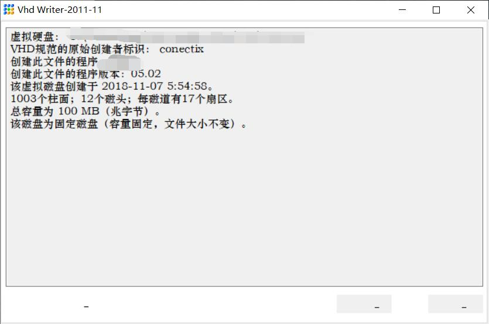

4. 点击“Quit”退出

### 源代码编译链接

linux环境下安装GCC和nasm，进入项目目录执行如下命令
```
make mbr
```
制作mbr.bin文件，制作完成后文件在boot目录中。该文件为主引导扇区文件。
```
make kernel
make kernel1
make kernel2
make kernel3
```
以上四条命令任选一个，制作kernel.bin文件，制作完成后文件在kernel目录中。该文件为内核文件，包括内核全部的功能。其中命令结尾无数字代表不启动编译优化，有数字则代表优化级别（**已知O3优化会导致键盘无法使用，原因未知**）。
```
make a
make b
```
制作a.bin和b.bin文件,制作完成后文件在user目录中，这两个文件为两个示例用户程序，a.bin内的代码会循环打印“\nHello\n”,b.bin内的代码会循环打印“\nWorld\n”，两个示例此程序均使用C编写，在user目录下。

### 使用 fixvhdwr.exe 写入.vhd文件
按照下图所示方法完成如下步骤
+ 将 boot/mbr.bin 文件 0 号扇区
+ 将 kernel/kernel.bin 文件写入 1 号扇区
+ 将 user/a.bin 写入 50000 号扇区
+ 将 user/b.bin 写入 60000 号扇区
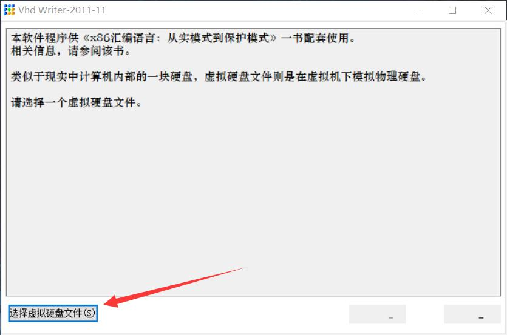
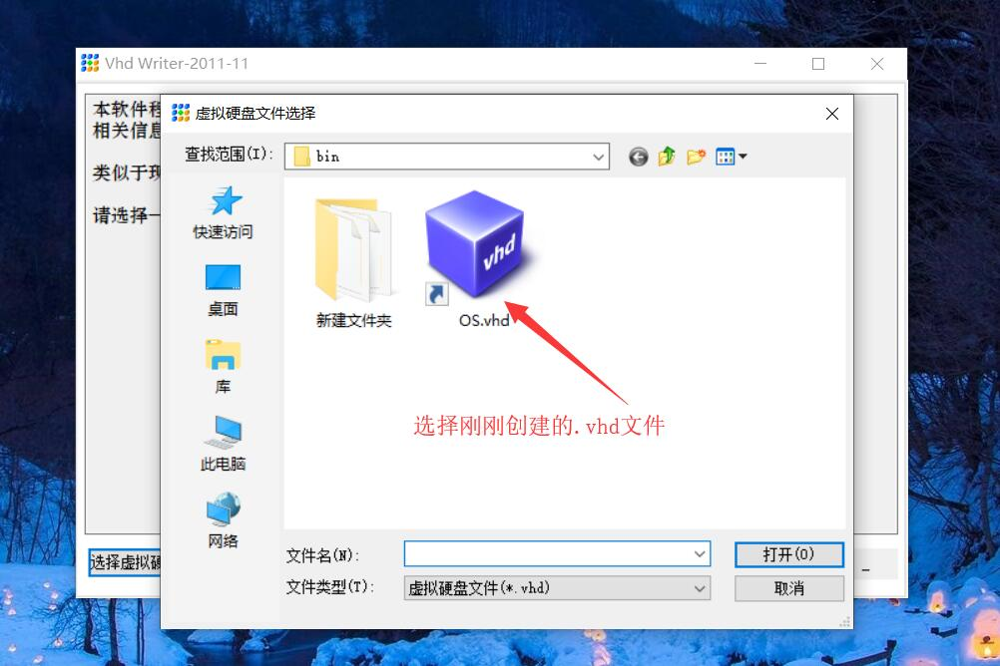
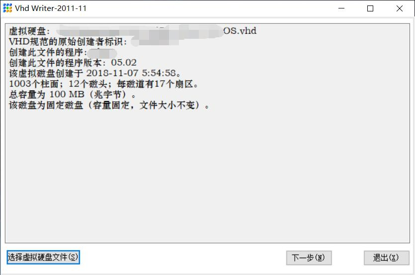
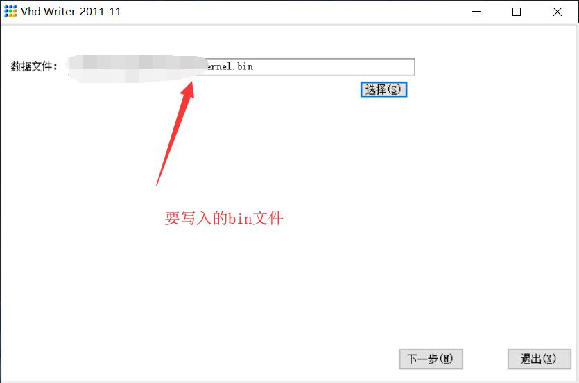
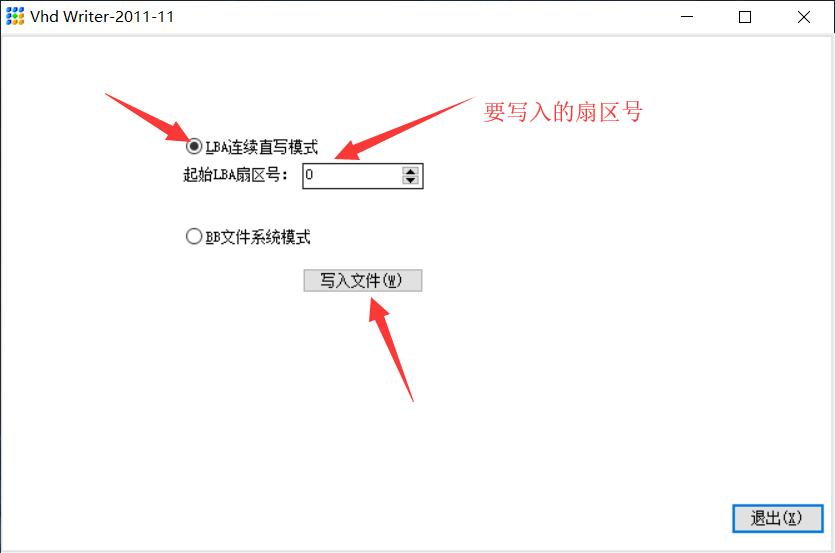

## 运行程序
运行bochs安装目录下的“bochsdbg.exe”

*bochs有很多调试命令，读者可自行搜索。*

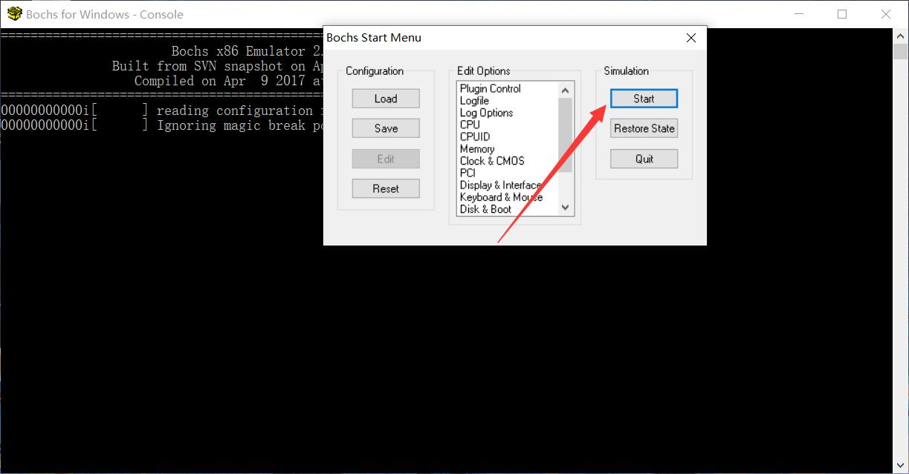
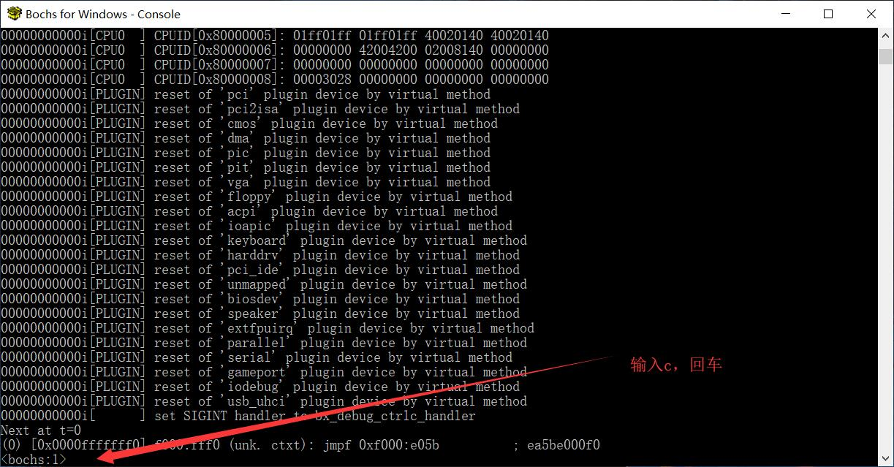
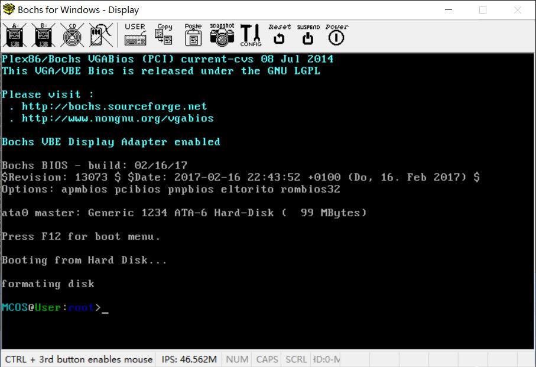

**出现上图的显示请时可以摁下字母键数字键进行输入，但是命令行界面无任何有效命令，按退格键也无效。**

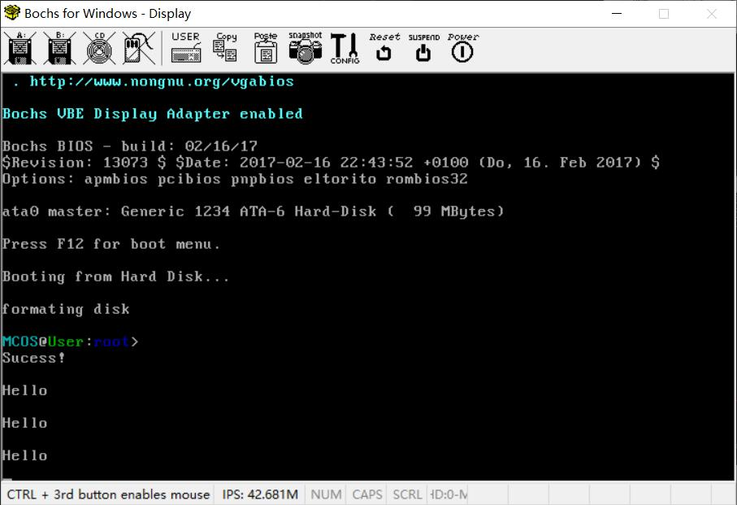

**一段时间后屏幕会自动打印Hello，并且此时命令行依旧可以使用，按回车键可以唤出命令行。**

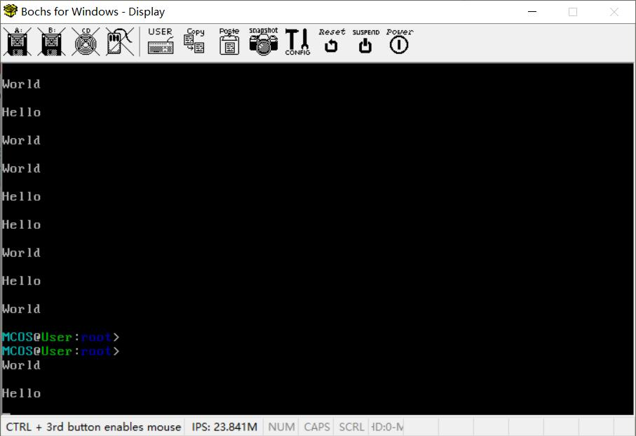

**再过一段时间后如果出现上述的情景，Hello 和 World交替打印，同时命令行可以正常使用，即代表内核运行正常。**

## 可能遇到的问题

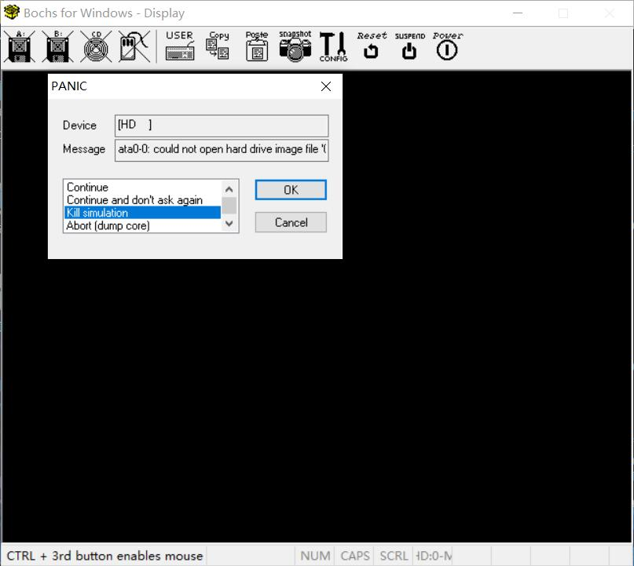

**进入到存放vhd文件的目录，寻找是否存在.lock文件，删除即可。如果无效或无此文件，尝试以管理员身份运行。**

# 其他问题
+ 系统调用号为0x80,eax为系统调用号，ebx,ecx,edx,edi 分别为从左到右的第 1 2 3 4 个系统调用参数。
+ 目前没有考虑多个打印进程之间的冲突问题，可能会出现打印错乱的现象
+ 目前内核占用的初始内存大小最好不要超过3.0MB，否则可能会出现问题，因为在mbr.asm内仅仅将4MB的空间划分为内核的初始内存。
+ 写这个内核的时候是大二，没有接触软件工程，代码规范也不是很了解，代码应该很烂·····我尽力改了改。

# 版权

代码内容采用 新BSD许可
